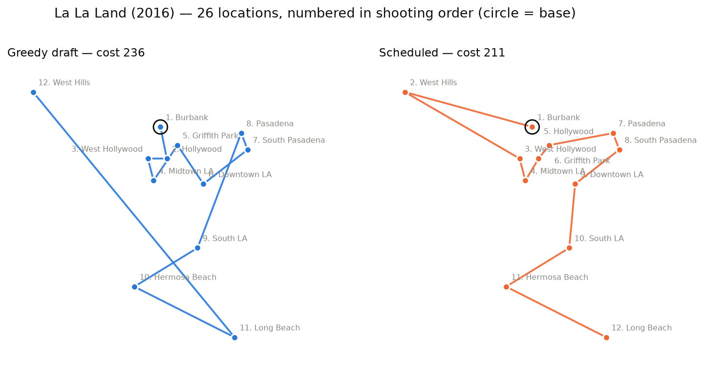

# Stripboard

**Finds the shooting order that minimises the cost of moving a film crew between locations — and proves when it's optimal.**

On set, the assistant director plans the shooting order on a *stripboard*: one strip of paper per scene, shuffled until the schedule works. Stripboard does that shuffling with algorithms.



## How it works

```
filming locations ──▶ geographic layer ──▶ cost matrix ──▶ scheduling layer ──▶ shooting order
                      terrain-weighted                      exact subset DP,
                      graph + Dijkstra                      MST partitioning
```

1. **What does each move cost?** Each location has a terrain type and elevation. Edges are weighted by distance, climb and terrain, and all-pairs Dijkstra gives the true cheapest cost between every two locations. This matters: 81–85% of location pairs have no direct road.
2. **In what order to shoot?** This is a minimum-cost Hamiltonian path, which is NP-hard. Up to 20 locations, a Held-Karp subset DP returns a **proven optimum**. For larger productions, a minimum spanning tree splits the map into regions (block shooting), and the DP solves exactly within and across them.

## Results

Tested on **90 real filming locations from three films**, at three scales:

| Production | Scale | Locations | Greedy draft | Stripboard | Saving |
|---|---|---|---|---|---|
| La La Land (2016) | one city | 26 | 235.86 | **210.68** | **10.7%** |
| Forrest Gump (1994) | one country | 30 | 12,927.26 | **12,124.09** | **6.2%** |
| Tenet (2020) | seven countries | 34 | 36,203.99 | **34,283.38** | **5.3%** |

- **Correct:** 1,160 random cases checked against brute-force enumeration of every permutation, with 0 disagreements.
- **Near-exact at scale:** on the largest subset of each film that can still be proven optimal (20 locations), the partitioned method matched the proven optimum on all three, in milliseconds instead of ~6.5 s.
- **Greedy has no guarantee:** on synthetic benchmarks, nearest-neighbour ranged from optimal to 28% above optimal.

## Run it

Python 3.10+, standard library only.

```bash
python -m stripboard la_la_land      # schedule a film (also: forrest_gump, tenet)
pip install pytest && pytest         # run the test suite
python -m experiments.reproduce      # regenerate every number in the report
```

## Project structure

```
stripboard/geo/          terrain-weighted graph, Dijkstra, road network
stripboard/scheduling/   greedy baseline, subset DP, MST partitioning, solver
stripboard/data/         synthetic benchmarks and the three films' locations
experiments/             benchmarks, figures, report reproduction
tests/                   correctness checks against brute force
docs/                    full report, figures, class presentation
```

Full method, analysis and limitations: [docs/REPORT.md](docs/REPORT.md) · Slides: [ruisnow-e.github.io/stripboard](https://ruisnow-e.github.io/stripboard/presentation/)

## Credits

CS5800 Algorithms, Northeastern University, Summer 2026.
**Rui Song** ([@ruisnow-e](https://github.com/ruisnow-e)) built the scheduling layer and the real-film dataset.
**Guoyue Liu** ([@Gi-gi-Liu](https://github.com/Gi-gi-Liu)) built the geographic layer.
